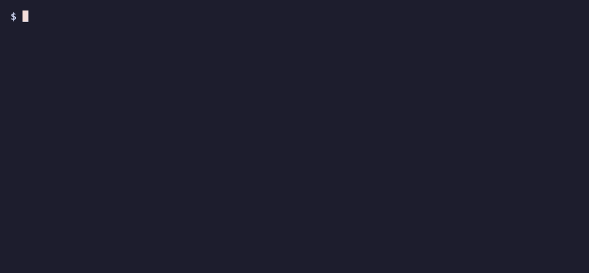
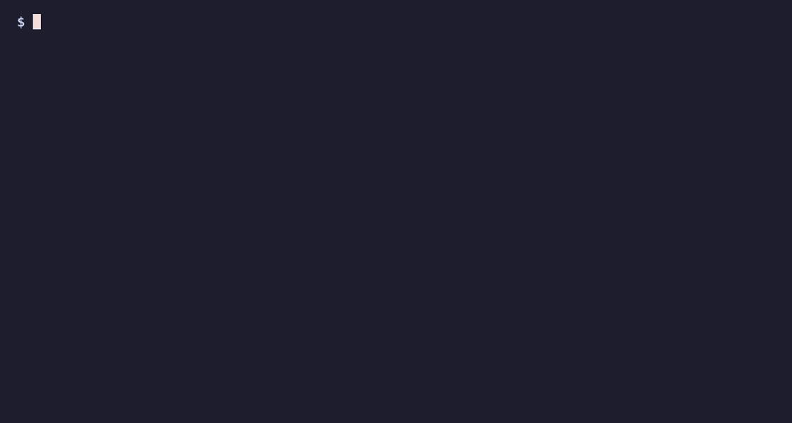
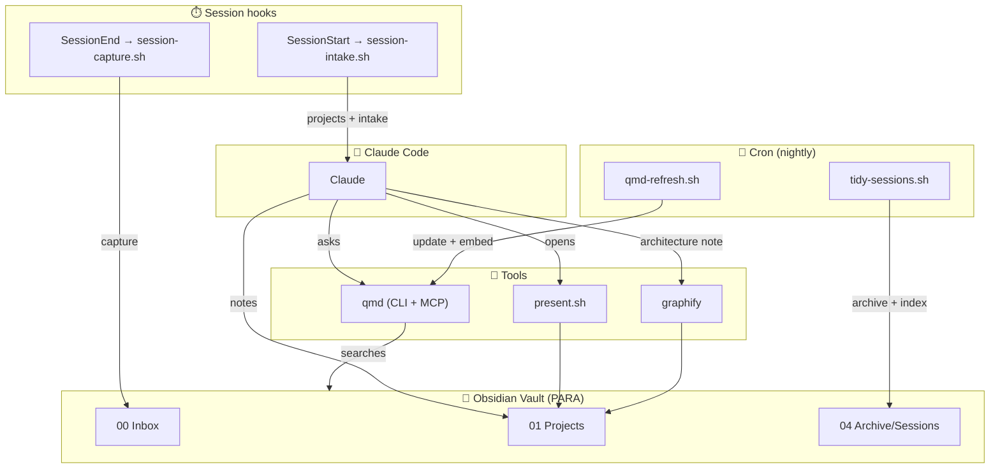

# 🧠 brain-os — the second brain that knows your *code*

> **Work lands in the right project. Your repos' architecture lives next to your notes. One question searches both — fully local. One `/brain-setup`.**

<p>


</p>

A Claude Code **plugin** that makes Obsidian a *developer's* second brain — not just notes, but your **projects, their code repos, and the architecture**, unified and searchable. Local-first, MIT.

> ⭐ **If this saves you setup time, a star helps others find it.**

## Why brain-os

**① Sessions know your projects — and their repos.** Every session starts aware of your projects; new work files into the right one, and code tasks run in the linked repo.



**② Your code's architecture, mapped into your brain.** `graphify` turns any repo into named feature-clusters + diagrams, deposited right beside your notes — code and knowledge in one place.



**③ Ask once — answers from notes AND code.** Local semantic search (qmd: BM25 + vectors + rerank) across the whole vault, including the code maps. No cloud, no API key.


> Built by distilling a working personal setup into a reusable, path-agnostic package. **Your data stays local;** qmd & graphify are *installed/linked*, not bundled.

## What you get

| Capability | What it does |
|---|---|
| **Project-aware session start** | A `SessionStart` hook tells Claude the vault is the primary store and lists your projects + their linked code repos, so new work files into the right place and code tasks run in the right repo. |
| **Code-architecture in your vault** | [graphify](https://github.com/safishamsi/graphify) maps a code repo into named feature-clusters + diagrams and deposits an architecture note into its vault project — searchable alongside your notes. |
| **Unified semantic search** | [qmd](https://github.com/tobi/qmd) indexes the vault (local BM25 + vector + rerank) and is exposed to Claude as an MCP server — meaning-based answers across notes *and* code maps. |
| **Automatic session capture** | A `SessionEnd` hook drops a session note into the Inbox. Default = a lightweight pointer; opt in to a short **LLM summary** (headless `claude`, detached) with `BRAIN_CAPTURE_SUMMARY=1`. |
| **PARA vault** | `00 Inbox`, `01 Projects/<…>`, `02 Areas`, `03 Resources`, `04 Archive` + starter notes |
| **Pitch canvases** | The `brain-canvas` skill builds a presentation [JSON Canvas](https://jsoncanvas.org) per project; say *"I want to present X"* to open it. |
| **Self-maintaining** | Nightly cron archives + indexes captures (`tidy-sessions.sh`) and refreshes the search index (`qmd-refresh.sh`). |

## System map



## Install

```text
/plugin marketplace add 9fw2pq8sgb-art/obsidian-brain-os
/plugin install brain-os@obsidian-brain-os
/brain-setup
```

`/brain-setup` walks you through: vault path → config → PARA scaffold → qmd → cron → (optional) graphify.

### Prerequisites
- **Obsidian** (with the *Obsidian Git* plugin recommended for auto-versioning).
- **Node ≥ 22** and (macOS) `brew install sqlite` — for **qmd** (`npm install -g @tobilu/qmd`).
- **pipx** + Python ≥ 3.10 — for optional **graphify** (`pipx install graphifyy`).
- `jq` for some setup steps.

## How configuration works
All scripts read one config file: `~/.config/brain-os/config`
```bash
BRAIN_VAULT="/absolute/path/to/your/vault"
# optional: auto-summarize each session with headless `claude` instead of a pointer note
# BRAIN_CAPTURE_SUMMARY=1
```
(Override per-invocation with the `BRAIN_VAULT` env var, or point elsewhere with `BRAIN_OS_CONFIG`.)
Hooks **no-op silently** until this is set, so installing the plugin never breaks a session.
The LLM summary uses your Claude Code login (no separate API key) and runs detached so it never blocks session end.

## Layout
```
obsidian-brain-os/
├── .claude-plugin/{marketplace,plugin}.json
├── hooks/hooks.json                 # SessionStart + SessionEnd
├── commands/brain-setup.md          # /brain-setup
├── skills/brain-canvas/SKILL.md     # pitch-canvas generator
├── scripts/                         # lib, intake, capture, tidy, qmd-refresh, present
└── templates/                       # qmd-index.yml, obsidian-graph.json, PARA vault skeleton
```

## Credits
Stands on the shoulders of [qmd](https://github.com/tobi/qmd) (Tobias Lütke),
[graphify](https://github.com/safishamsi/graphify), and [obsidian-skills](https://github.com/kepano/obsidian-skills) (Steph Ango).

## License
MIT — see [LICENSE](LICENSE).
